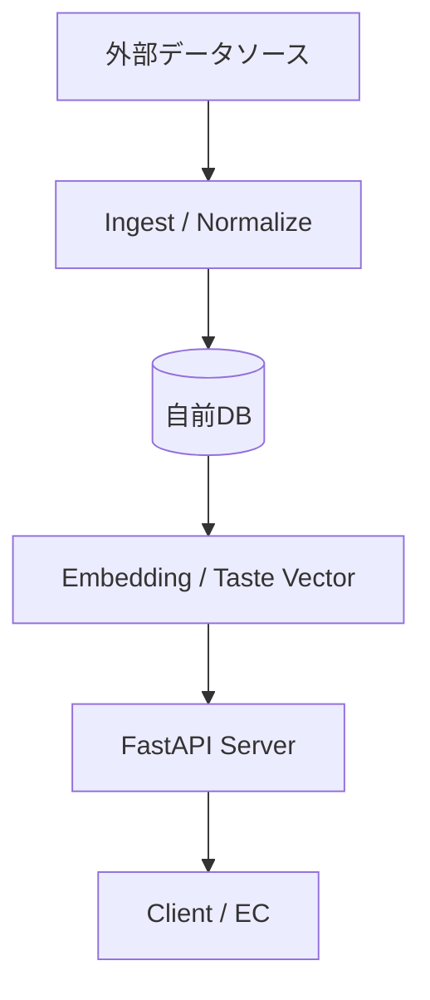

# Sake Recommendation API MVP

## プロダクト概要
ユーザーの嗜好（料理・食材・自然文）から**日本酒の味の方向性を推定し、ミスマッチを防ぐレコメンドAPI**です。
「味のイメージ違いによるハズレ購入」を防ぎ、専門用語がわからなくても自分好みの日本酒に出会えることを目指しています。

## 特徴
本APIは、外部API（さけのわなど）の単純なラッパーではありません。
以下の3点により、独自の付加価値を提供します。

1.  **正規化/名寄せ**: 銘柄名・蔵名・表記ゆれを統一し、データをクリーンに保ちます。
2.  **味ベクトル付与**: レビューや説明文から「甘辛」「濃淡」などの味覚情報をベクトル化し、独自の推論ロジックでマッチングを行います。
3.  **推薦理由の提示**: 単に商品を提示するだけでなく、「なぜそれがおすすめなのか」という理由（Explainability）を生成して返却します。

## アーキテクチャ



外部データへのリアルタイム依存を避け、定期的にデータを取り込み（Ingest）、正規化・ベクトル化して自前DBに蓄積することで、安定性と高速なレスポンスを実現します。

## 技術スタック

- **API Framework**: FastAPI
- **Environment**: Python 3.11
- **Deployment**: Docker / Docker Compose

## セットアップ手順

開発・実行には **uv (venv)** の使用を推奨します。
Docker環境も用意してありますので、必要に応じてご利用ください。

### ローカルでの実行（推奨: uv 使用）

1. **依存関係のインストール**

   ```bash
   uv sync
   # または
   uv pip install -r requirements.txt
   ```

2. **データベースの初期化とダミーデータの投入** (初回のみ)

   ```bash
   uv run python scripts/init_db.py
   uv run python scripts/seed_dummy.py
   ```

3. **サーバー起動**

   ```bash
   source .venv/bin/activate
   uv run uvicorn app.main:app --reload --port 8000
   ```

4. **動作確認 (Health check)**

   ブラウザで [http://localhost:8000/health](http://localhost:8000/health) にアクセスし、`{"status": "ok"}` が返れば起動成功です。
  
   APIドキュメント（Swagger UI）は [http://localhost:8000/docs](http://localhost:8000/docs) で確認できます。

### API利用例

#### 1. レコメンド取得
好みの日本酒を探します。

Request
```bash
curl -X 'POST' \
  'http://localhost:8000/recommend' \
  -H 'Content-Type: application/json' \
  -d '{
  "text": "魚料理に合う、すっきりした辛口",
  "top_k": 3
}'
```

Response

```json
{
  "input_text": "魚料理に合う、すっきりした辛口",
  "top_k": 3,
  "mode": "embedding",
  "query": {
    "taste_vector": [
      -1.0,
      -0.9,
      0.0,
      0.0
    ]
  },
  "recommendations": [
    {
      "sake_id": 1153,
      "name": "皆生温泉",
      "brewery": "",
      "prefecture": "鳥取県",
      "score": 0.7655083372637198,
      "distance": 0.2344916627362802,
      "taste_vector": [
        -0.7,
        -0.9,
        0.0,
        0.0
      ],
      "reason": "「すっきり」や「辛口/キレ」というご希望に対し、このお酒は軽快な飲み口、キレのある後味が特徴で、相性が良いと判断しました。",
      "debug_info": null
    },
    {
      "sake_id": 954,
      "name": "磯丸",
      "brewery": "",
      "prefecture": "青森県",
      "score": 0.7637245198244834,
      "distance": 0.23627548017551658,
      "taste_vector": [
        -1.0,
        -0.8,
        0.0,
        0.0
      ],
      "reason": "「すっきり」や「辛口/キレ」というご希望に対し、このお酒は軽快な飲み口、キレのある後味が特徴で、相性が良いと判断しました。",
      "debug_info": null
    },
    {
      "sake_id": 2333,
      "name": "甚",
      "brewery": "",
      "prefecture": "石川県",
      "score": 0.7609299041857094,
      "distance": 0.23907009581429062,
      "taste_vector": [
        -1.0,
        -0.9,
        0.0,
        0.0
      ],
      "reason": "「すっきり」や「辛口/キレ」というご希望に対し、このお酒は軽快な飲み口、キレのある後味が特徴で、相性が良いと判断しました。",
      "debug_info": null
    }
  ]
}
```

```bash
curl -X 'POST' \
  'http://localhost:8000/recommend' \
  -H 'Content-Type: application/json' \
  -d '{
  "text": "寒菊ホワイトが好き",
  "top_k": 3
}'
```

```json
```json
{
  "input_text": "寒菊ホワイトが好き",
  "top_k": 3,
  "mode": "embedding",
  "query": {
    "taste_vector": [
      0.0,
      0.0,
      0.0,
      0.0
    ]
  },
  "recommendations": [
    {
      "sake_id": 2191,
      "name": "寒菊 どぶろく 銀八",
      "brewery": "寒菊銘醸",
      "prefecture": "千葉県",
      "score": 0.7290643010485687,
      "distance": 0.2709356989514313,
      "taste_vector": [
        0.0,
        0.0,
        0.0,
        0.0
      ],
      "reason": "ご希望のイメージに対し、全体のバランスが良く、おすすめの一本です。",
      "debug_info": null
    },
    {
      "sake_id": 2582,
      "name": "奥能登の白菊",
      "brewery": "白藤酒造店",
      "prefecture": "石川県",
      "score": 0.724866323275971,
      "distance": 0.275133676724029,
      "taste_vector": [
        0.19999999999999996,
        0.30000000000000004,
        1.0,
        -0.09999999999999998
      ],
      "reason": "ご希望のイメージに対し、このお酒は華やかな香りが特徴で、相性が良いと判断しました。",
      "debug_info": null
    },
    {
      "sake_id": 1140,
      "name": "総乃寒菊",
      "brewery": "寒菊銘醸",
      "prefecture": "千葉県",
      "score": 0.7236299743899591,
      "distance": 0.27637002561004087,
      "taste_vector": [
        0.19999999999999996,
        0.0,
        1.0,
        0.8
      ],
      "reason": "ご希望のイメージに対し、このお酒は華やかな香りが特徴で、相性が良いと判断しました。",
      "debug_info": null
    }
  ]
}
```


#### 2. 銘柄検索
銘柄名や蔵元名で検索します。

```bash
curl 'http://localhost:8000/search?q=八海山'
```

#### 3. 銘柄一覧取得
登録されている銘柄を一覧で取得します。

```bash
curl 'http://localhost:8000/sakes?limit=10'
```

### Docker での実行（Optional）

1. **ビルド & 起動**

   ```bash
   docker compose up --build
   ```

## Embedding機能の利用 (Experimental)

Gemini APIを利用して、自然文からの検索精度を向上させる機能です。

1. **環境変数の設定**

   ```bash
   export GEMINI_API_KEY="your_api_key_here"
   export USE_EMBEDDING=1
   ```

2. **Embeddingの事前計算**

   ```bash
   uv run python scripts/compute_embeddings.py
   ```

3. **サーバー起動**

   通常通りサーバーを起動すると、Embeddingベースのレコメンドが有効になります。


## ディレクトリ構成
```
.
├── app/                # アプリケーションコード
│   └── main.py         # エントリーポイント
├── scripts/            # ユーティリティスクリプト
│   ├── init_db.py      # DB初期化
│   └── seed_dummy.py   # ダミーデータ投入
├── docs/               # 設計書・仕様書
├── var/                # データベースファイル
├── Dockerfile          # Docker設定
├── docker-compose.yml  # Docker Compose設定
└── requirements.txt    # 依存ライブラリ
```

## ドキュメント

詳細は `docs/` ディレクトリを参照してください。
- [設計書](docs/sake_recommend_design.md)
- [仕様書](docs/spec.md)

## マスタデータ提供元について

本プロジェクトは「さけのわデータ」(https://sakenowa.com) を利用しています。
(データ提供: https://muro.sakenowa.com/sakenowa-data)