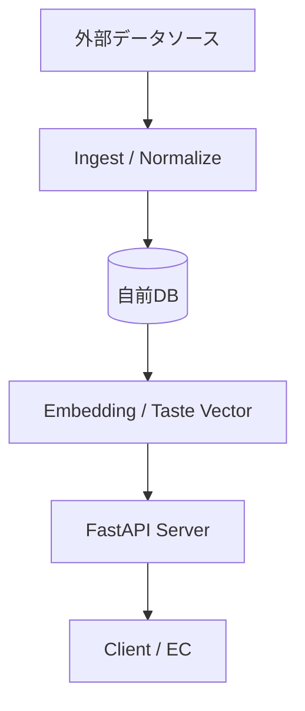

# Sake Recommendation API MVP

## プロダクト概要
ユーザーの嗜好（料理・食材・自然文）から**日本酒の味の方向性を推定し、ミスマッチを防ぐレコメンドAPI**です。
「味のイメージ違いによるハズレ購入」を防ぎ、専門用語がわからなくても自分好みの日本酒に出会えることを目指しています。

## 特徴
本APIは、外部API（さけのわなど）の単純なラッパーではありません。
以下の3点により、独自の付加価値を提供します。

1.  **正規化/名寄せ**: 銘柄名・蔵名・表記ゆれを統一し、データをクリーンに保ちます。
2.  **味ベクトル付与**: レビューや説明文から「甘辛」「濃淡」などの味覚情報をベクトル化し、独自の推論ロジックでマッチングを行います。
3.  **推薦理由の提示**: 単に商品を提示するだけでなく、「なぜそれがおすすめなのか」という理由（Explainability）を生成して返却します。

## アーキテクチャ



外部データへのリアルタイム依存を避け、定期的にデータを取り込み（Ingest）、正規化・ベクトル化して自前DBに蓄積することで、安定性と高速なレスポンスを実現します。

## 技術スタック
- **API Framework**: FastAPI
- **Environment**: Python 3.11
- **Deployment**: Docker / Docker Compose

## セットアップ手順

開発・実行には **uv (venv)** の使用を推奨します。
Docker環境も用意してありますので、必要に応じてご利用ください。

### ローカルでの実行（推奨: uv 使用）

1. **依存関係のインストール**

   ```bash
   uv sync
   # または
   uv pip install -r requirements.txt
   ```

2. **データベースの初期化とダミーデータの投入** (初回のみ)

   ```bash
   uv run python scripts/init_db.py
   uv run python scripts/seed_dummy.py
   ```

3. **サーバー起動**

   ```bash
   source .venv/bin/activate
   uv run uvicorn app.main:app --reload --port 8000
   ```

4. **動作確認 (Health check)**

   ブラウザで [http://localhost:8000/health](http://localhost:8000/health) にアクセスし、`{"status": "ok"}` が返れば起動成功です。
   
   APIドキュメント（Swagger UI）は [http://localhost:8000/docs](http://localhost:8000/docs) で確認できます。

### Docker での実行（Optional）

1. **ビルド & 起動**

   ```bash
   docker compose up --build
   ```

## ディレクトリ構成
```
.
├── app/                # アプリケーションコード
│   └── main.py         # エントリーポイント
├── scripts/            # ユーティリティスクリプト
│   ├── init_db.py      # DB初期化
│   └── seed_dummy.py   # ダミーデータ投入
├── docs/               # 設計書・仕様書
├── var/                # データベースファイル
├── Dockerfile          # Docker設定
├── docker-compose.yml  # Docker Compose設定
└── requirements.txt    # 依存ライブラリ
```

## ドキュメント
詳細は `docs/` ディレクトリを参照してください。
- [設計書](docs/sake_recommend_design.md)
- [仕様書](docs/spec.md)
